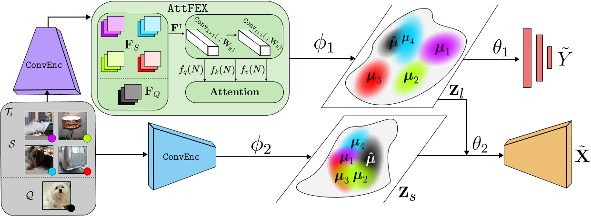
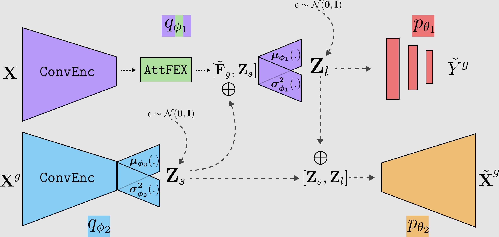
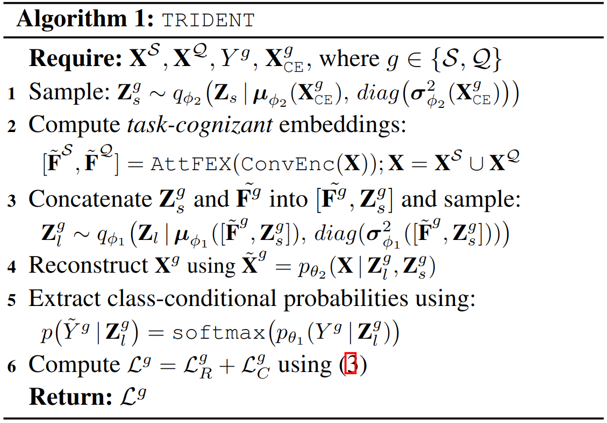
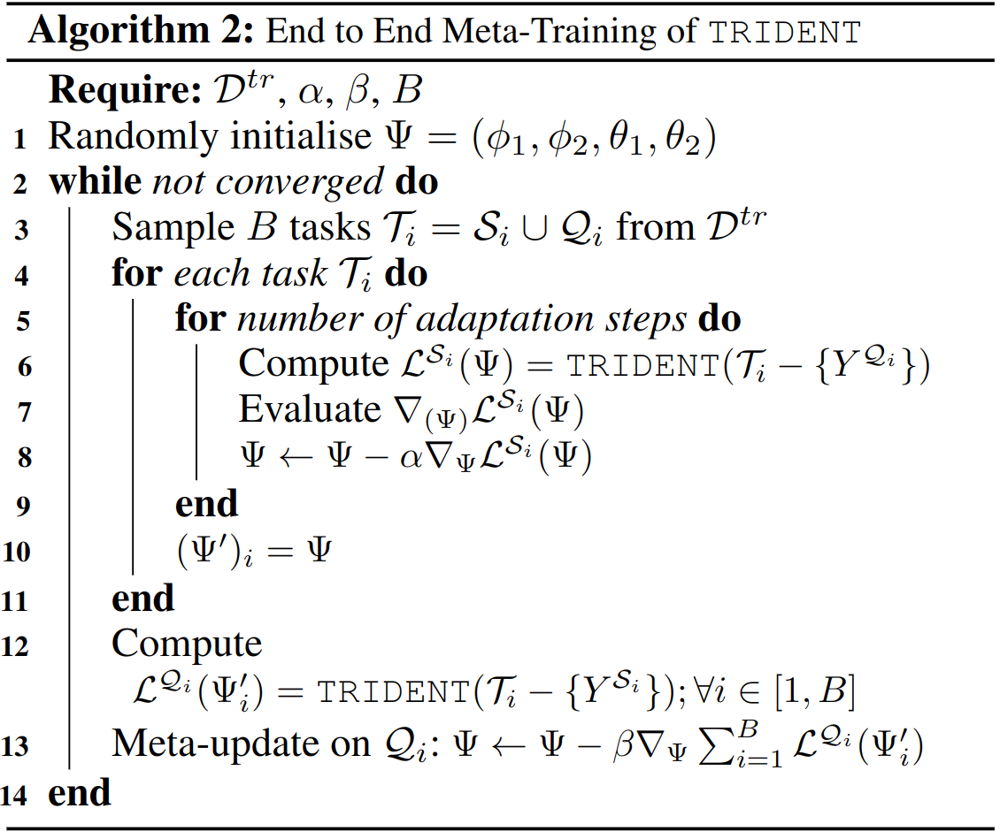

# CodeBase of TRIDENT
This is the official repository for [Transductive Decoupled Variational Inference For Few Shot Classification](arxiv.com) (Anuj Singh, Hadi Jamali-Rad)


# Abstract
The versatility to learn from a handful of samples is the hallmark of human intelligence. Few-shot learning is an endeavour to transcend this capability down to machines. Inspired by the promise and power of probabilistic deep learning, we propose a novel variational inference network for few-shot classification (coined as TRIDENT) to decouple the representation of an image into _semantic_ and _label_ latent variables, and simultaneously infer them in an intertwined fashion. To induce _task-awareness_, as part of the inference mechanics of TRIDENT, we exploit information across both query and support images of a few-shot task using a novel built-in attention-based transductive feature extraction module (we call AttFEX). Our extensive experimental results corroborate the efficacy of TRIDENT and demonstrate that, using the simplest of backbones, it sets a new state-of-the-art in the most commonly adopted datasets miniImageNet and tieredImageNet (offering up to 4% and 5% improvements, respectively), as well as for the recent challenging cross-domain miniImagenet --> CUB scenario offering a significant margin (up to 20% improvement) beyond the best existing cross-domain baselines.

# Intuition
The proposed approach is devised to learn meaningful representations that capture two pivotal characteristics of an image by modelling them as separate latent variables: (i) *z*<sub>s</sub> representing _semantics_, and (ii) *z*<sub>l</sub> embodying class _labels_. Inferring these two latent variables simultaneously allows *z*<sub>l</sub> to learn meaningful distributions of class-discriminating characteristics _decoupled_ from semantic features represented by *z*<sub>s</sub>. We argue that learning *z*<sub>l</sub> as the sole latent variable for classification results in capturing a mixture of true label and other semantic information. This in turn can lead to sub-optimal classification performance, especially in a few-shot setting where the information per class is scarce and the network has to adapt and generalize quickly. By inferring decoupled label and semantics latent variables, we inject a handcrafted inductive-bias that incorporates only relevant characteristics, and thus, ameliorates the network's classification performance.


# Algorithm
## TRIDENT
Algorithm Flow             |  Algorithm - TRIDENT      |  Algorithm - Training
:-------------------------:|:-------------------------:|:-------------------------:
  |      | 


# Walkthrough
Directories containing the mentioned files/scripts and their descriptions: 
* `configs`: Contains train and test configs of mini and tieredImagenet for (5-way, 1 and 5-shot) settings. The params have been set to their corresponding best hyperparameter settings. For more details on what each field of the .json's mean, check their descriptions in `src/train.py`, `src/test.py`. Make sure to check that the paths in their respective fields are set correctly. 
* `data`: Contains scripts of dataloaders in `loaders.py` and task generators in `taskers.py`.
* `dataset`: This is where the .tar's of all the datasets are to be extracted. (read more about this in the next section)
* `logs`: This is where the .csv's of the logs generated by train/test scripts are saved. Set the path to this directory in the `log_path` field of .json configs.
* `models`: The best models for each setting are to be kept here. These are loaded and run for the `test.py` scripts of their corresponding setting. We obtained the best model at the 82,000-th and 67,500-th iteration for (5-way, 1-shot) mini and tieredImagenet tasks respectively, and at the 22,500-th and 48,000-th iteration for (5-way, 5-shot) mini and tieredImagenet tasks, respectively.
* `src/zoo`: Contains all the model architectures in `archs.py` and the loss functions, inner-update function and task loaders in `trident_utils.py`.
* `src`: Contains the `train.py`, `test.py` scripts, and the `utils.py` script responsible for logging and saving and .csv's, models.pt's and latents.pt's.    


# Data:
We use the datasets miniImagenet and tieredImagenet provided by [Ren et al, 2018. "Meta-Learning for Semi-Supervised Few-Shot Classification." ICLR '18](https://github.com/renmengye/few-shot-ssl-public) and the dataset of CUB200-2011 from [here](http://www.vision.caltech.edu/visipedia/CUB-200-2011.html) and make use of the splits given by [Chen et al.](https://arxiv.org/abs/1904.04232). 
1. miniImagenet: Use [this](https://drive.google.com/file/d/16V_ZlkW4SsnNDtnGmaBRq2OoPmUOc5mY/view) link to download the dataset. Extract the .tar file in the `dataset` directory.
2. tieredImagenet: Use [this](https://drive.google.com/file/d/1g1aIDy2Ar_MViF2gDXFYDBTR-HYecV07/view) link to download the dataset. Extract the .tar file in the `dataset` directory.
3. CUB200-2011: Use [this](https://drive.google.com/file/d/1hbzc_P1FuxMkcabkgn9ZKinBwW683j45/view) link to download the dataset. Extract the .tar file in the `dataset` directory in the `cubirds200` directory.
   

# Run Scripts:
First use the `requirements.txt` file to create an environment containing all the necessary libraries and packages. Then use these commands to run train and test scripts:
```python
python -m src.trident_train --cnfg PATH_TO_CONFIG.JSON
python -m src.trident_test --cnfg PATH_TO_CONFIG.JSON
```

# Analyse the logs:
Run the `analysis.ipynb` notebook to analyse the logs generated by running the train/test script.

# Contact
Corresponding author: Anuj Singh (<anujrsingh1@gmail.com>; <a.r.singh@student.tudelft.nl>)